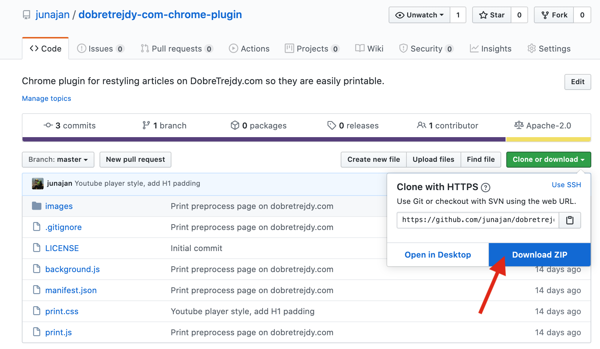
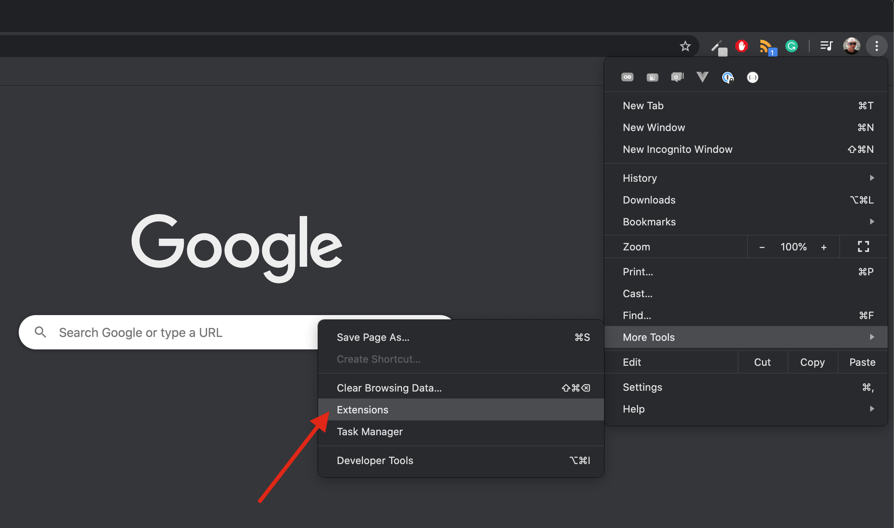
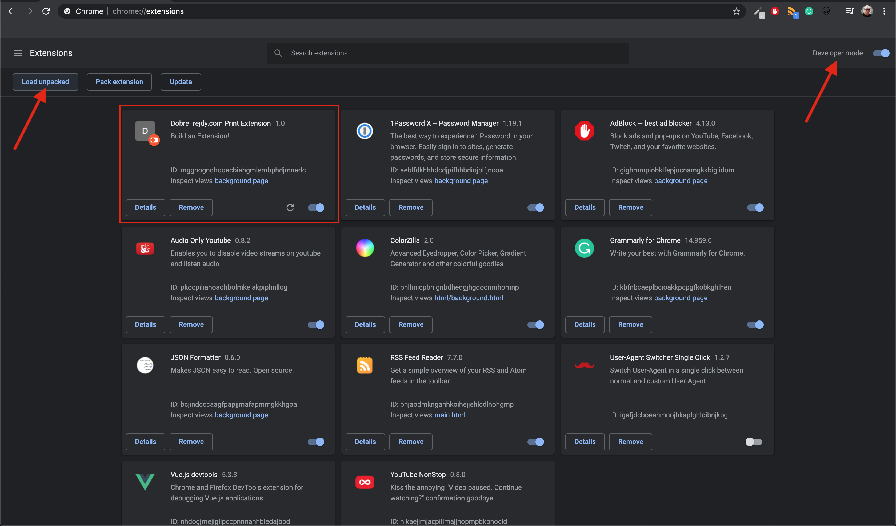
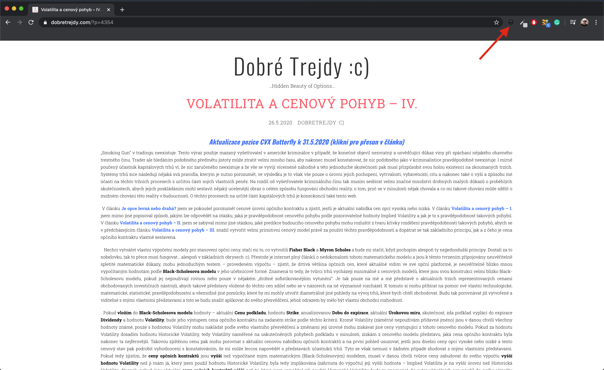

# DobreTrejdy.com Chrome Plugin

Plugin which styles articles on website [dobretrejdy.com](dobretrejdy.com) so they are more print friendly.

# Installation & Usage

1) Download extension ZIP file from [here](https://github.com/junajan/dobretrejdy-com-chrome-plugin/archive/master.zip) or here:

    

2) Unzip downloaded ZIP file.

3) Open Chrome Extensions console:
    
    
    
4) Enable `Developer mode` and `Load Unpacked` extension (unzipped folder):

    

5) Toggle print styles:

    
